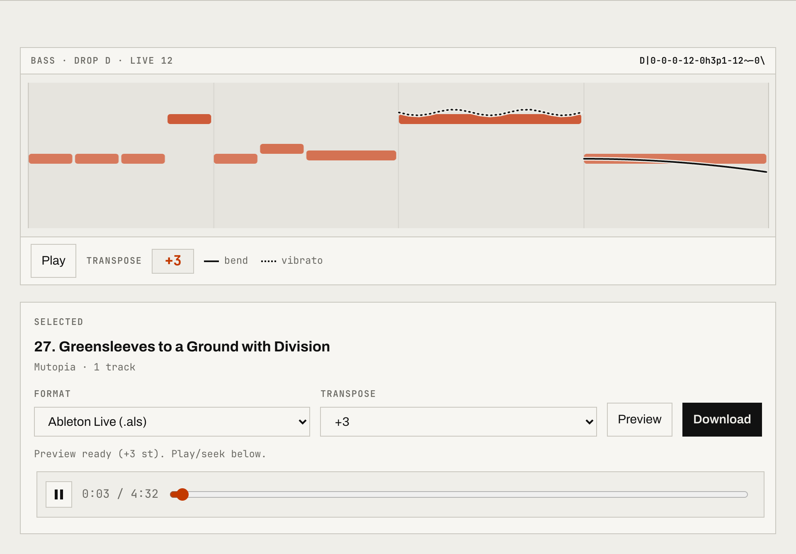

# Ready Set

simply jam.

Formerly tabridge; the code, crate and commands keep that name.

Turn your own tabs and scores into an Ableton Live set you can actually play
with.

Open a Guitar Pro or MusicXML file, hear it, and export either a
multi-track Ableton Live set (`.als`) or a plain Standard MIDI file (`.mid`). The `.als` opens in Ableton Live 12 with named
tracks, one clip per song section in the Session view, a full arrangement, the
tempo, and stock instruments so it makes sound out of the box. Transpose shifts
every track except drums.

The whole engine is a Rust core compiled to WebAssembly, so the same parsing and
export code runs in two places: a local web app and an Ableton extension.

## In pictures

<a href="media/loop-paper.mp4"></a>

Files to share: [loop, Paper](media/loop-paper.mp4) · [loop, Night](media/loop-night.mp4) · [still, Paper](media/site-paper.png) · [still, Night](media/site-night.png)

## Sources

| Source | Kind | How | Status |
|---|---|---|---|
| Guitar Pro | your own `.gp`, `.gpx`, `.gp5`, `.gp4`, `.gp3` | file import | main path |
| MusicXML | your own `.musicxml`/`.xml` | file import | main path |
| Mutopia | public-domain scores | online search | always on |
| BitMidi | fan-made MIDI | online search | opt-in, fine for practice, not for release |
| FreeMIDI | fan-made MIDI | online search | opt-in, fine for practice, not for release |

MIDI files open in Ableton Live directly, so Ready Set doesn't take them as a
file; pieces found by online search still arrive as MIDI and become a set.

Your own files are the main input: Ready Set converts what you already have, and
the files are parsed locally (in the browser, or in the extension host) and
never uploaded. Online search is secondary. Mutopia's scores are public domain;
BitMidi and FreeMIDI hold fan-made transcriptions of copyrighted songs, so they
stay off until you tick **Include fan-made MIDI (fine for practice, not for
release)**. The **Sources** note beside it lists which sites are searched. The Ableton
extension can also load your own local source modules (see
[`extension/README.md`](extension/README.md)).

Guitar Pro and MusicXML carry notated rhythm and articulations
(slides, bends, vibrato), so their `.als` keeps full fidelity. Guitar Pro files
are read with the MIT-licensed [`guitarpro`](https://codeberg.org/slundi/scorelib)
crate, vendored in `third_party/guitarpro/` with one change so it builds for
WebAssembly (see `TABRIDGE-PATCH.md` there). `cargo run --example
write_sample_gp -- out.gp` writes a small self-made `.gp` for testing, and
`cargo run --example gp_report -- <folder> [notes]` runs every Guitar Pro file
in a folder through the importer and both writers. Checked 2026-09-26 against
23 editor-made files (PyGuitarPro's GP3-5 test files, alphaTab's GP6/GP7 ones,
kept out of the repo): 22 import cleanly; PyGuitarPro's `Measure Header.gp5`
still fails inside the GP5 parser. The MIDI archives carry note
timing only, so their `.als` places notes at their absolute beats and reads
section markers when the file has them. Every source exports both `.als` and
`.mid`.

## Build and test

```sh
cargo test                                   # offline: doctests, roundtrip, MusicXML, Guitar Pro, .als
wasm-pack build --target web --out-dir web/pkg          # browser package
wasm-pack build --target nodejs --out-dir extension/pkg --out-name tabridge   # extension package
```

The core stays platform-independent: parsing and emitting are pure, and each
surface injects its own fetch (the browser goes through a proxy, the extension
host fetches over the network).

## Web app

A local page: drop in a Guitar Pro or MusicXML file (or search online), choose `.als`
or `.mid` plus a transpose, preview, download. The WASM does all the parsing and
encoding in the browser. A small Python proxy forwards the allow-listed source
requests for online search so the browser can get around CORS, and it runs
FreeMIDI's two-step cookie download server-side.

`scripts/web_smoke.py` drives the page end to end in headless Chrome (file
import, search, pick, downloads, preview, colour modes); it needs the server
running and the project `.venv` with Playwright.

The preview (main page and `/try/`) plays through `shared/midiplay.js`:
spessasynth (the design system's build, in `shared/vendor/design/sound/spessasynth/`)
with the design system's shared General MIDI bank (`shared/vendor/design/sound/gm.sf3`, the
same sounds as every other tool that plays MIDI), a small play / stop / seek
bar, and a piano roll that follows the playhead. Nothing loads from a CDN.
`scripts/web_player_check.py` checks in headless Chrome that it is heard
(drums included) and that the roll follows; it serves `web/` itself.

The bassline at the top of the main page (`web/hero.js`) plays through the same
spessasynth and bank, on General MIDI's picked electric bass: each note on its
own channel, its bend, vibrato and legato glides on the pitch wheel (±48
semitones), its loudness on CC11, and Transpose moving the notes already
sounding. `node scripts/test_hero.mjs` checks the curves and the MIDI;
`scripts/hero_sound_check.py` records it in headless Chrome and checks that the
pitch heard follows the curve within a few cents, at two Transpose settings and
while Transpose moves.

**Prerequisites:** [`wasm-pack`](https://crates.io/crates/wasm-pack) (`cargo install wasm-pack`)
and Python 3 (standard library only, no `pip install`).

```sh
# 1. Build the WASM package into web/pkg (re-run after changing Rust code).
wasm-pack build --target web --out-dir web/pkg

# 2. Start the server (default port 8000; pass another, e.g. scripts/serve.py 9000).
scripts/serve.py
```

Open <http://localhost:8000> and stop with `Ctrl-C`. If you started it detached,
`lsof -ti:8000 | xargs kill` frees the port. See [`docs/browser.md`](docs/browser.md)
for how the proxy and WASM bindings fit together.

The public site is a static build at <https://swwallowws.github.io/ready-set/>,
this repo's GitHub Pages: CI builds it on every push to `main` and publishes it.
`scripts/deploy-web.sh --stage DIR` builds and stages it. Without the proxy it searches BitMidi directly (it allows cross-origin
requests), Mutopia from the frozen `/try/` catalogue, and leaves FreeMIDI out.

## Ableton extension

`extension/` is an Ableton Extensions SDK extension (Ableton Live 12.4.5, Node host). It
adds a right-click action (**Import a song…**) that opens a file (or searches
online), previews it, and builds it straight into the Set you have open: one MIDI track per part, a Session
scene per section, an arrangement clip, a Pitch device for transpose, and audible
stock instruments (a synthesized kit for drums). The whole build is one undo step.

```sh
cd extension
npm install
npm start          # builds the bundle and attaches to a running Ableton Live
```

For online search, the extension routes its fetches through the same
`scripts/serve.py` proxy the web app uses, so start that first (opening a file
needs no proxy). See [`extension/README.md`](extension/README.md)
for the SDK limits it works around and the wishlist those limits feed.

## Command-line

```sh
# MusicXML file to .mid (no network)
cargo run --example musicxml_to_mid -- score.musicxml out.mid --semitones -2

# MusicXML file to .als
cargo run --example musicxml_to_als -- score.musicxml out.als
```

## Look

Both UIs use the shared design system (`~/Playground/design`, category
`transform`), synced into `shared/vendor/design/` with its `sync.sh`
(`sync.sh shared --sound`, so the preview's soundfont comes too). The web
page links its `tokens.css`; the extension build inlines it, fonts included,
into the modal. `shared/roll.js` draws piano rolls for both, following the
system's `roll.md`. `scripts/modal_preview.py` renders the extension modal
outside Ableton Live for a visual check.

## Design

[`SPEC.md`](SPEC.md) has the full design. The short version: a `Song → Track →
Measure → Voice → Beat → Note` model with absolute MIDI pitch and rational
durations, a `Source::load` trait for adding inputs, a `midly`-based MIDI writer,
and an `.als` writer that clones a real Ableton Live 12 template and injects the tracks,
clips, scenes, and tempo.
